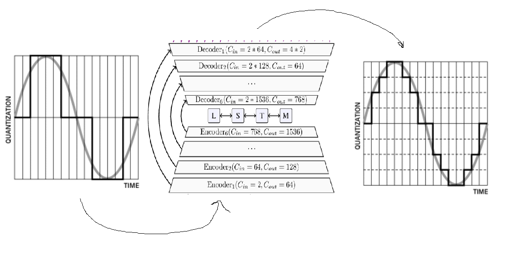

# mp3_super-resolution
Notebook that uses facebook's denoiser architecture to do real-time mp3 audio kbps upsample
in super-resulution style method.

### Requirements:

  1) pytorch
  2) torchaudio
     
## Illustration

